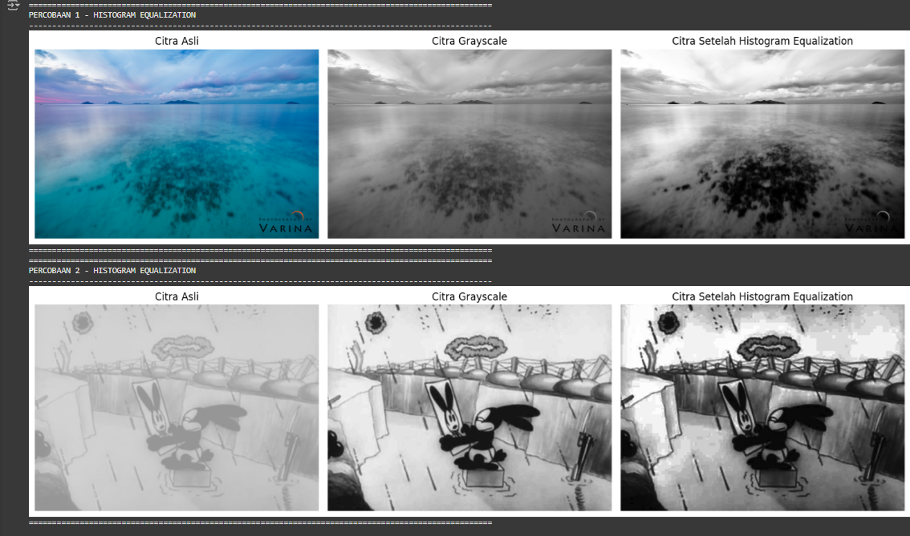
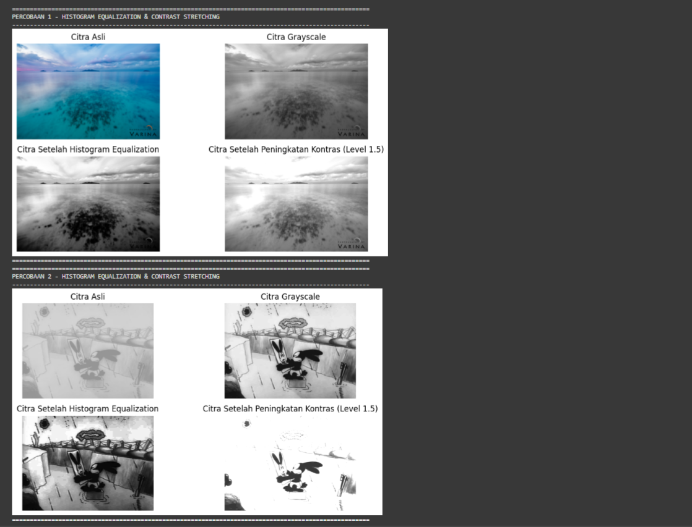

# Ujian Pengolahan Citra

## 1. Soal: Jelaskan apa yang dimaksud dengan **image enhancement**

**Penjelasan tentang Image Enhancement**:  
**Image Enhancement** adalah proses perbaikan kualitas citra untuk meningkatkan visibilitas objek dalam citra, sehingga lebih mudah dianalisis atau lebih enak dilihat. Image Enhancement merupakan langkah awal dalam pengolahan citra (preprocessing) yang bertujuan untuk memperjelas fitur penting dalam citra atau memperbaiki kekurangan seperti pencahayaan rendah, kontras buruk, atau noise.

**Tujuan Image Enhancement**:

- Meningkatkan kualitas citra yang terpengaruh oleh berbagai faktor.
- Memudahkan analisis dan pengenalan objek dalam citra.

**Metode Umum**:

1. **Mencerahkan Citra**: Meningkatkan kecerahan.
2. **Menegatifkan Citra**: Membalikkan nilai piksel.
3. **Peregangan Kontras**: Meningkatkan kontras.
4. **Histogram Equalization**: Mendistribusikan intensitas piksel secara merata.

## 2. Soal: Peningkatan Kontras Menggunakan Histogram Equalization

**Kode:**
Kode program dapat dilihat pada file `main.py` atau pada tautan google colab berikut [UTS Pengolahan Citra](https://colab.research.google.com/drive/1Pln0v8ZhMfp57R2XpimhG34mV0fmi_SB?hl=id#scrollTo=769RrHg3zI51).

**Menampilkan Gambar Hasil Praktek**:

## 3. Soal: Program untuk Meningkatkan Kontras

**Menampilkan Gambar Hasil Praktek**:

### Kesimpulan Perbandingan Praktek pada Soal 2 dan 3

- **Citra Setelah Histogram Equalization**: Kontras meningkat secara signifikan, detail yang sebelumnya tersembunyi menjadi lebih terlihat. Teknik ini mendistribusikan intensitas piksel secara merata, sehingga meningkatkan visibilitas objek dalam gambar. Histogram equalization lebih cocok untuk gambar dengan kontras rendah yang intensitasnya tidak merata.
- **Citra Setelah Peningkatan Kontras (Level 1.5)**: Citra menjadi lebih cerah, tetapi ada risiko overexposure di area terang dan hilangnya detail di area gelap. Peningkatan kontras dengan level tertentu harus dilakukan dengan hati-hati agar tidak menghilangkan informasi penting. Peningkatan kontras cocok untuk gambar dengan distribusi intensitas yang sudah baik tetapi memerlukan peningkatan kontras.

## Author

- Ahmad Sidik Rudini
- 220401020034
